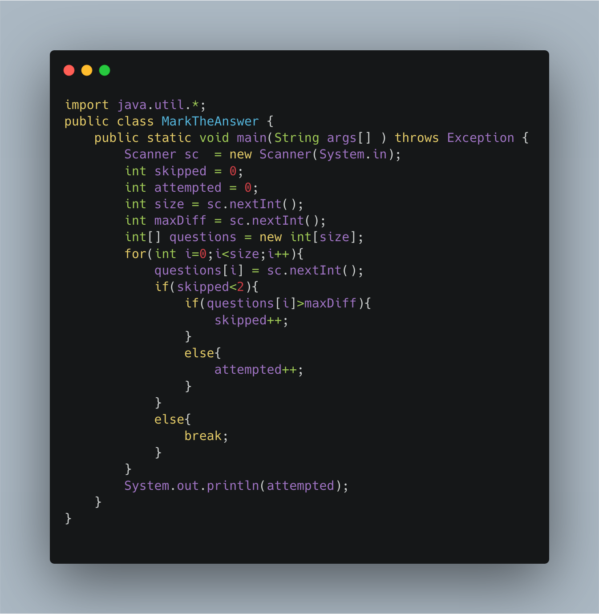

### Mark the Answer

-----

Our friend Monk has an exam that has quite weird rules. Each question has a difficulty level in the form of an Integer. Now, Monk can only solve the problems that have difficulty level less than X . Now the rules are-

    Score of the student is equal to the maximum number of answers he/she has attempted without skipping a question.
    Student is allowed to skip just "one" question that will not be counted in the continuity of the questions.

Note- Assume the student knows the solution to the problem he/she attempts and always starts the paper from first question.

Given the number of Questions, N ,the maximum difficulty level of the problem Monk can solve , X ,and the difficulty level of each question ,

can you help him determine his maximum score?

Input Format
```
First Line contains Integer N , the number of questions and the maximum difficulty X Monk can solve.
Next line contains N integers,denoting the difficulty level of each question.
``
Output Format
```
Maximum score Monk can achieve in the exam.

----

```
SAMPLE INPUT

7 6
4 3 7 6 7 2 2

SAMPLE OUTPUT
3
```


----




------


